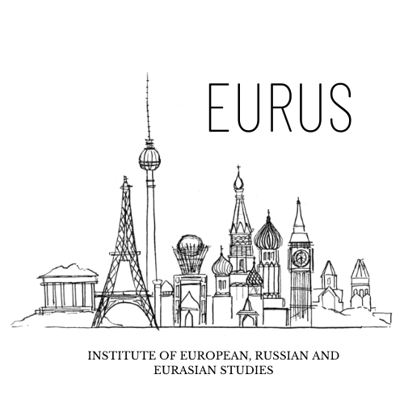

The cities of post-Soviet Eurasia are home to two-thirds of the area’s population, making them crucial arenas for assessing broader societal shifts in the region. Modern Eurasian cities were transformed dramatically due to Soviet urbanization, further taking shape following the collapse of the USSR with each country’s varied approach to post-independence economic reforms and governance.

This course aims to provide students with an overarching understanding of these processes through the lens of urban transformations, with lectures grounded in a range of interdisciplinary academic literature, multimedia, news stories, and popular culture. The course is structured around weekly thematic topics with several city case studies, including the drivers of Soviet and post-Soviet urbanization; the political economy of urban development; housing, informality, and inequality; heritage preservation; urban social movements; and contested place meanings.

The Urban Transformations in Post-Soviet Eurasia course is offered at Carleton University's Institute of European, Russian and Eurasian Studies. A detailed syllabus is available [here](https://carleton.ca/eurus/wp-content/uploads/UTPSE_Course_Outline_April06_2021.pdf)